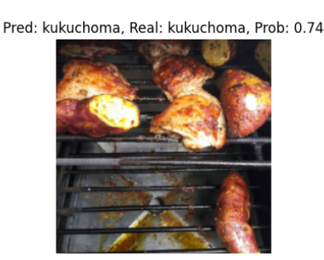
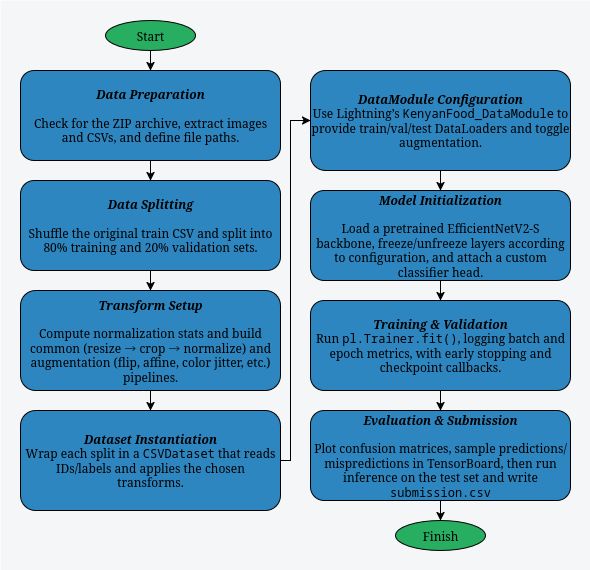

# Kenyan Cuisine Image Classifier

This project provides an end‑to‑end image classification pipeline for traditional Kenyan dishes using PyTorch Lightning and the TIMM EfficientNetV2‑S backbone. A custom CSV‑based Dataset and LightningDataModule handle data loading, optional augmentation, and train/val/test splits, while transfer learning and fine‑tuning routines let you progressively unfreeze layers with configurable hyperparameters. Built‑in utilities log and visualize performance in TensorBoard (including confusion matrices, sample predictions/mispredictions, and learning curves), and a final script generates a submission CSV of predicted dish classes on the test set.

---

## Example Results
Below are a few validation images examples alongside the model’s predictions. Each thumbnail shows a predicted dish name with its confidence score and the true label for reference.

### Sample Predictions:

<div style="display: flex; justify-content: center; overflow-x: auto; width: 80%;">
  <table style="table-layout: auto; border-collapse: collapse;">
    <thead>
      <tr>
        <th style="text-align: left; padding: 8px;">Bhaji Prediction</th>
        <th style="text-align: left; padding: 8px;">Chapati Prediction</th>
        <th style="text-align: left; padding: 8px;">Githeri Prediction</th>
      </tr>
    </thead>
    <tbody>
      <tr>
        <td style="padding: 8px;">
          
        </td>
        <td style="padding: 8px;">
          
        </td>
        <td style="padding: 8px;">
          
        </td>
      </tr>
    </tbody>
  </table>
</div>

<div style="display: flex; justify-content: center; overflow-x: auto; width: 80%;">
  <table style="table-layout: auto; border-collapse: collapse;">
    <thead>
      <tr>
        <th style="text-align: left; padding: 8px;">Kachumbari Prediction</th>
        <th style="text-align: left; padding: 8px;">Kukuchoma Prediction</th>
        <th style="text-align: left; padding: 8px;">Mandazi Prediction</th>
      </tr>
    </thead>
    <tbody>
      <tr>
        <td style="padding: 8px;">
          
        </td>
        <td style="padding: 8px;">
          
        </td>
        <td style="padding: 8px;">
          
        </td>
      </tr>
    </tbody>
  </table>
</div>

<div style="display: flex; justify-content: center; overflow-x: auto; width: 80%;">
  <table style="table-layout: auto; border-collapse: collapse;">
    <thead>
      <tr>
        <th style="text-align: left; padding: 8px;">Masalachips Prediction</th>
        <th style="text-align: left; padding: 8px;">Matoke Prediction</th>
        <th style="text-align: left; padding: 8px;">Mukimo Prediction</th>
      </tr>
    </thead>
    <tbody>
      <tr>
        <td style="padding: 8px;">
          
        </td>
        <td style="padding: 8px;">
          
        </td>
        <td style="padding: 8px;">
          
        </td>
      </tr>
    </tbody>
  </table>
</div>

<div style="display: flex; justify-content: center; overflow-x: auto; width: 80%;">
  <table style="table-layout: auto; border-collapse: collapse;">
    <thead>
      <tr>
        <th style="text-align: left; padding: 8px;">Nyamachoma Prediction</th>
        <th style="text-align: left; padding: 8px;">Pilau Prediction</th>
        <th style="text-align: left; padding: 8px;">Sukumawiki Prediction</th>
      </tr>
    </thead>
    <tbody>
      <tr>
        <td style="padding: 8px;">
          
        </td>
        <td style="padding: 8px;">
          
        </td>
        <td style="padding: 8px;">
          
        </td>
      </tr>
    </tbody>
  </table>
</div>
<div style="display: flex; justify-content: center; overflow-x: auto; width: 80%;">
  <table style="table-layout: auto; border-collapse: collapse;">
    <thead>
      <tr>
        <th style="text-align: left; padding: 8px;">Ugali Prediction</th>
        <th style="text-align: left; padding: 8px;"></th>
        <th style="text-align: left; padding: 8px;"></th>
      </tr>
    </thead>
    <tbody>
      <tr>
        <td style="padding: 8px;">
          
        </td>
        <td style="padding: 8px;">
          
        </td>
        <td style="padding: 8px;">
          
        </td>
      </tr>
    </tbody>
  </table>
</div>


### Training Performance Training and Validation Dataset:

<div style="display: flex; justify-content: center; overflow-x: auto; width: 80%;">
  <table style="table-layout: auto; border-collapse: collapse;">
    <thead>
      <tr>
        <th style="text-align: left; padding: 8px;">Training Loss/Acc on Validation and Training Dataset</th>
      </tr>
    </thead>
    <tbody>
      <tr>
        <td style="padding: 8px;">
          
        </td>
      </tr>
    </tbody>
  </table>
</div>

#### Plot Legend  

- **Orange**  
  Transfer learning _without_ data augmentation (only the final fully-connected layer is trained).
- **Deep Blue**  
  Fine-tuning of the last convolutional block with data augmentation.
- **Red**  
  Fine-tuning of the last two layers with data augmentation.
- **Light Blue**  
  Fine-tuning of the last three layers with data augmentation.
- **Pink**  
  Fine-tuning _all_ layers with data augmentation.
- **Green**  
  Fine-tuning _all_ layers _without_ data augmentation.


### Confusion Matrix:

<div style="display: flex; justify-content: center; overflow-x: auto; width: 80%;">
  <table style="table-layout: auto; border-collapse: collapse;">
    <thead>
      <tr>
        <th style="text-align: left; padding: 8px;">Confusion Matrix over validation dataset</th>
      </tr>
    </thead>
    <tbody>
      <tr>
        <td style="padding: 8px;">
          
        </td>
      </tr>
    </tbody>
  </table>
</div>

---

## What It Does

What it does

This project provides a complete pipeline for building, training, evaluating and deploying a deep‑learning model that classifies images of traditional Kenyan dishes. Specifically, it:

1. **Data loading & preprocessing**  
   - Reads image metadata from CSV files and organizes train/validation/test splits (with automatic 80/20 validation split if none is provided).  
   - Applies configurable transform pipelines (resize, crop, normalize) with optional augmentation (random flips, affine transforms, color jitter, equalization) to improve generalization.

2. **Modular PyTorch Lightning setup**  
   - Implements a custom `CSVDataset` and `KenyanFood_DataModule` for clean separation of data preparation and batching.  
   - Uses dataclass‑based configuration objects for easy control over batch size, image size, number of classes, augmentation flags and worker counts.

3. **Transfer learning & fine‑tuning**  
   - Leverages the EfficientNetV2‑S backbone (via TIMM) with pretrained ImageNet weights, freezing early layers and unfreezing progressively deeper blocks.  
   - Supports configurable learning rates, precision modes, early stopping and checkpointing, enabling staged fine‑tuning from the final fully‑connected layer back through all convolutional blocks.

4. **Logging & visualization**  
   - Integrates with TensorBoard to record training/validation loss and accuracy, parameter histograms, confusion matrices, sample predictions and mispredictions.  
   - Provides utility functions to compute and display detailed confusion matrices and grids of correct or misclassified examples at any epoch.

5. **Inference & submission**  
   - After training, runs inference on a held‑out test set, mapping image IDs to predicted dish classes.  
   - Generates a ready‑to‑upload CSV submission file listing each test image’s predicted label.

---

## Run Instructions

Clone the repository and build all projects in one step:

```bash
git clone https://github.com/sancho11/from_scratch_image_classifier.git
cd from_scratch_image_classifier
python -m venv .venv
source .venv/bin/activate  # On Windows, use: .venv\Scripts\activate
pip install -r requirements.txt
```

Get the dataset: `Instructions at get_dataset.md`


To run the project:

```bash
#For running the notebook pipeline using jupyter notebook
jupyter notebook
#For training a model using python
python train.py
#For running evaluation metrics on a trained model
python evaluate.py path/to/model
#For running classification on a single image.
python infierence.py path/to/model path/to/image
```

### Training
To get good inference results I recomend to follow this training sequence:

```bash
# 1. Quick check: run a fast test on the fully connected (FC) layer only
python train.py

# 2. Fine-tune starting from the last convolutional block
python train.py --data-augmentation --epochs 30 --learning-rate 2e-3   --fine-tune-start 5 --tb-name "Fine Tunning (4th convolutional layer forward to FC layer)" --ckpt_path tb_logs/training/version_0/checkpoints/last.ckpt

# 3. Unlock the 3rd convolutional block and continue fine-tuning
python train.py --data-augmentation --epochs 50 --learning-rate 2e-3   --fine-tune-start 4 --tb-name "Fine Tunning (3th convolutional layer forward to FC layer)" --ckpt_path tb_logs/Fine\ Tunning\ \(4th\ convolutional\ layer\ forward\ to\ FC\ layer\)/version_0/checkpoints/last.ckpt

# 4. Unlock the 2nd convolutional block and continue fine-tuning
python train.py --data-augmentation --epochs 90 --learning-rate 1e-3   --fine-tune-start 3 --tb-name "Fine Tunning (2nd convolutional layer forward to FC layer)" --ckpt_path tb_logs/Fine\ Tunning\ \(3th\ convolutional\ layer\ forward\ to\ FC\ layer\)/version_0/checkpoints/last.ckpt

# 5. Unlock the 1st convolutional block (still with augmentation) for further fine-tuning
python train.py --data-augmentation  --epochs 110 --learning-rate 1e-3 --fine-tune-start 2 --tb-name "Fine Tunning with data_aug (1st convolutional layer forward to FC layer)" --ckpt_path tb_logs/Fine\ Tunning\ \(2nd\ convolutional\ layer\ forward\ to\ FC\ layer\)/version_0/checkpoints/last.ckpt

# 6. Final stage: turn off data augmentation and train 20 more epochs
python train.py --epochs 130 --learning-rate 5e-4   --fine-tune-start 1 --tb-name "Fine Tunning wout data_aug (1st convolutional layer forward to FC layer)" --ckpt_path tb_logs/Fine\ Tunning\ with\ data_aug\ \(1st\ convolutional\ layer\ forward\ to\ FC\ layer\)/version_0/checkpoints/last.ckpt

```
### Evaluating
Generate confusion matrix and do inference over whole dataset
``` bash
python evaluate.py path/to/your/model/checkpoint

```

### Inferring
Do an inference on a single image using a trained model
``` bash
python infer.py path/to/your/model/checkpoint path/to/an/image
```

---

## Pipeline Overview
<p align="center">
  
  <br><em>Pipeline Diagram</em>
</p>


---

## Key Techniques & Notes

* **Custom CSV‑Driven Dataset & DataModule**
  Uses a `CSVDataset` to map image IDs and labels from CSV files into PyTorch tensors, with optional augmentation flags. All data loading, train/val/test splitting, and transform pipelines (resize, center‑crop, normalization vs. randomized flips/affine/color jitter) are encapsulated in a `KenyanFood_DataModule` for seamless integration with PyTorch Lightning.

* **Transfer Learning with EfficientNetV2‑S**
  Leverages the TIMM implementation of EfficientNetV2‑S pretrained on ImageNet. Early layers are frozen by default, and progressively unfreezed during fine‑tuning (configurable “fine\_tune\_start” epoch), allowing a balance between retaining learned features and adapting to Kenyan cuisine specifics.

* **Progressive Fine‑Tuning Strategy**
  Trains in phases: first only the final fully connected head, then incrementally unfreezes deeper convolutional blocks (from last block backward) while adjusting learning rates and data‑augmentation settings. This staged approach helps avoid catastrophic forgetting and accelerates convergence on a relatively small, domain‑specific dataset.

* **Weighted Loss & Class Imbalance Handling**
  Computes inverse‑frequency class weights from the training split to counteract class imbalance, feeding them into a weighted cross‑entropy loss. Ensures underrepresented dishes influence gradient updates appropriately.

* **TensorBoard Logging & Visualization**
  Integrates `TensorBoardLogger` callbacks to track scalar metrics (train/val loss & accuracy), parameter and gradient histograms, and rich figures:

  * **Confusion Matrices** via `get_confusion_matrix`
  * **Sample Predictions & Mispredictions** grids
  * **Training Curves** across fine‑tuning phases
    This makes it easy to monitor learning behavior and diagnose errors.

* **Reproducibility & Configuration**
  Uses `@dataclass`‑based configs (`DataConfiguration`, `TrainingConfiguration`) to centralize hyperparameters (batch size, epochs, learning rate, precision, augmentation flags), and seeds all randomness for deterministic splits and training runs.

* **Extensible, Modular Design**
  All components (dataset, transforms, training loop, evaluation, logging) are decoupled and reusable, allowing easy swapping of architectures, augmentation schemes, or logging backends for future projects.
